arthas简单入门


## Arthas官网

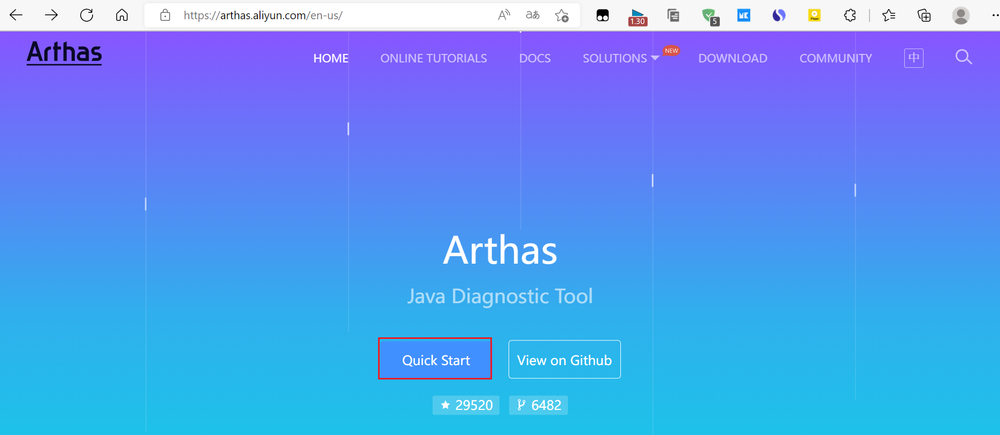

## 进入quick Start


这里用windows


这个是用来实验的一个jar包

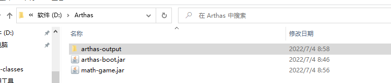


### 按tab键可以提示


### 1.先启动math-game.jar

```
java -jar arthas-boot.jar
```

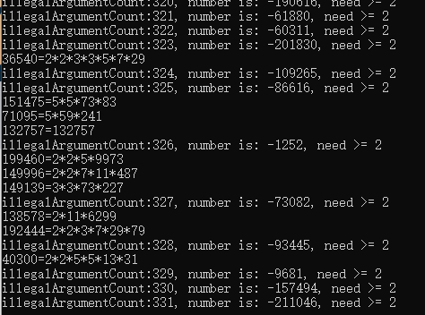

### 2.启动arthas

```
java -jar arthas-boot.jar
```

### 3.选择线程

我们看到 math-game.jar 

线程1

**输入1敲回车**

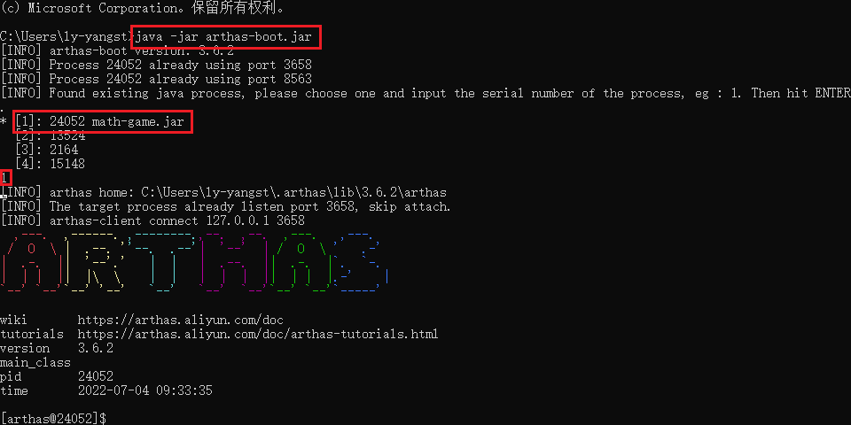


## 仪表盘

```
dashboard
```

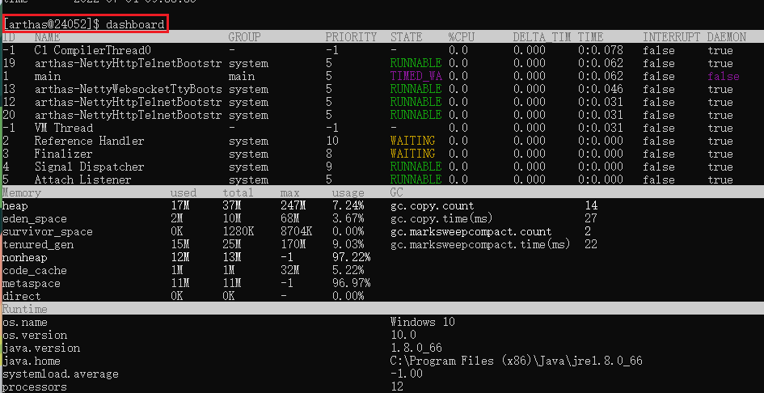

main方法的线程一般为1

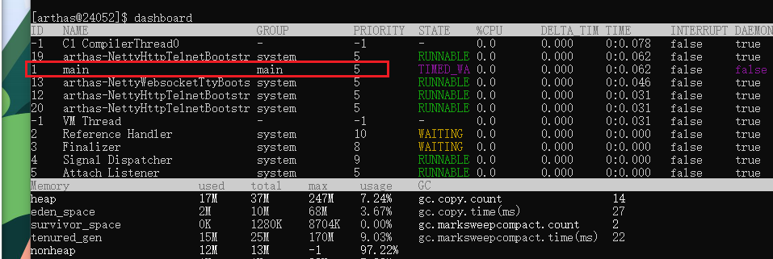

## 线程

```
thread
```

查看1线程

```
thread 1
```

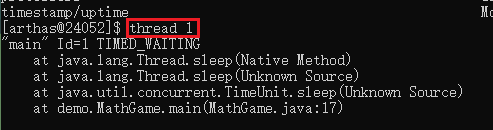

查看main方法的位置

```
thread 1 | grep  'main('
```

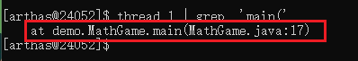

## 反编译

(将在跑的程序反编译看看)

```
jad demo.MathGame
```

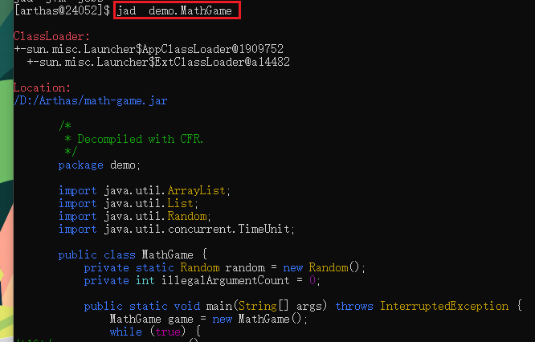

## 监视

```
watch demo.MathGame primeFactors returnObj
```

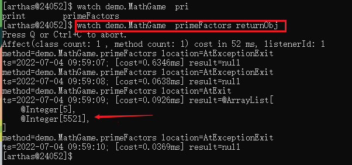

## 离开

```
stop
```

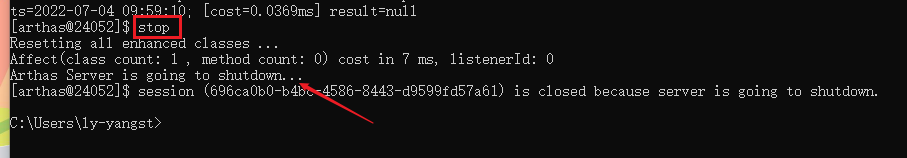