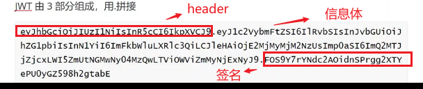
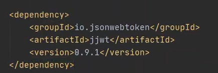
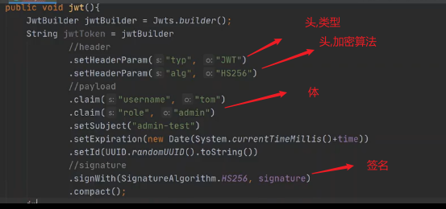
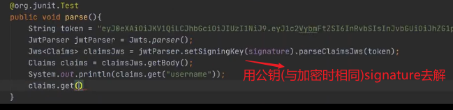

JWT

jwt是JSON WEB TOKEN 所以它本质上是个JSON字符串

jwt由 头,体,签名三部分通过"."连接组成

header里面存着,加密方法,加密算法,payload体里存着一些用户信息,生成时间之类的自定义信息,header和payload用base64编码成非明文放在jwt的前两个位置.

第三个位置放着signature签名,它是通过头里面指定的加密算法,以一个签名为钥匙(这个钥匙放在后台代码里,别人看不见),加密header和payload,生成jwt的第三部分

解密时,只要后台代码把钥匙拿过来,一解析,看解出来的和payload或者header相不相同就行,这样就不需要用什么redis去缓存里看一下验证了.

最重要的一点是,怎么防止别人伪造,jwt是有一个过期时间,如果别人拿到一个过期的jwt,是不是就可以生成新的jwt呢...当然你这里http要加固成https.防止别人抓包直接搞到你的jwt..

如果拿到一个过期的jwt,他可以base64反编译知道你的头,体..搞到你的加密算法,以及加密前的数据(如果你加个时间,也许他在这一步就搞不定了),就算知道算法,知道加密数据,由于不知道签名(钥匙),也仿制不出来jwt

代码

jwt的依赖

代码

加密

解密

