SpringMVC


## MVC模式

### 一句话解释MVC模型

控制器作为中介,将数据模型,视图绑定好,返回给用户

**model**数据模型

**view**视图

**controller**控制器


### 流程

1.用户点击按钮,就会发送一个请求到一个url

2.服务器处理请求,返回给用户一个响应


**SpringMvc是MVC模式在java中的实现形式**


## SpringMvc的前世今生


### JSP+JavaBean

jsp接收请求,访问JavaBean获得Model,然后JSP将Model绑到View上,返回给用户

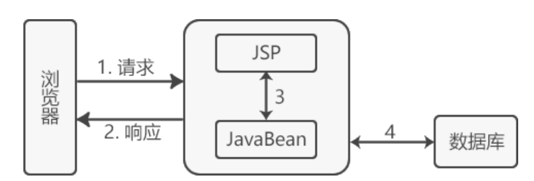


### Servlet+JSP+JavaBean

进化版

1.请求到达Servlet(doPost,doGet)

2.Servlet将找JavaBean获取Model

3.Servlet把拿到的Model给JSP的View生成ModelAndView

4.返回给用户

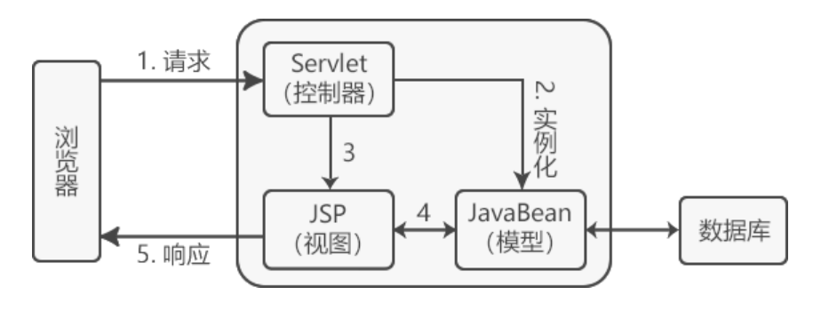


springMvc是一个表现层框架,是Servlet+JSP+JavaBean的实现,**本质**上是Servlet


## springMvc的运行流程

核心是**前端控制器**DispatcherServlet,充分***解耦***的关键,***灵活,适配,可重用***

请求给到DispatcherServlet,现根据请求的url获得**处理器**Handler,

DispatcherServlet将Handler给到**处理器适配器**HandlerAdapter,

HandlerAdapter调用**处理器**Handler,也就是后台写的Controller,返回ModelAndView,

DispatcherServlet将ModelAndView交给**视图处理器**ViewResolver,生成**视图对象**返给DispatcherServlet,

DispatcherServlet将**视图对象**渲染生成View(将数据模型填充到视图中),响应给用户.

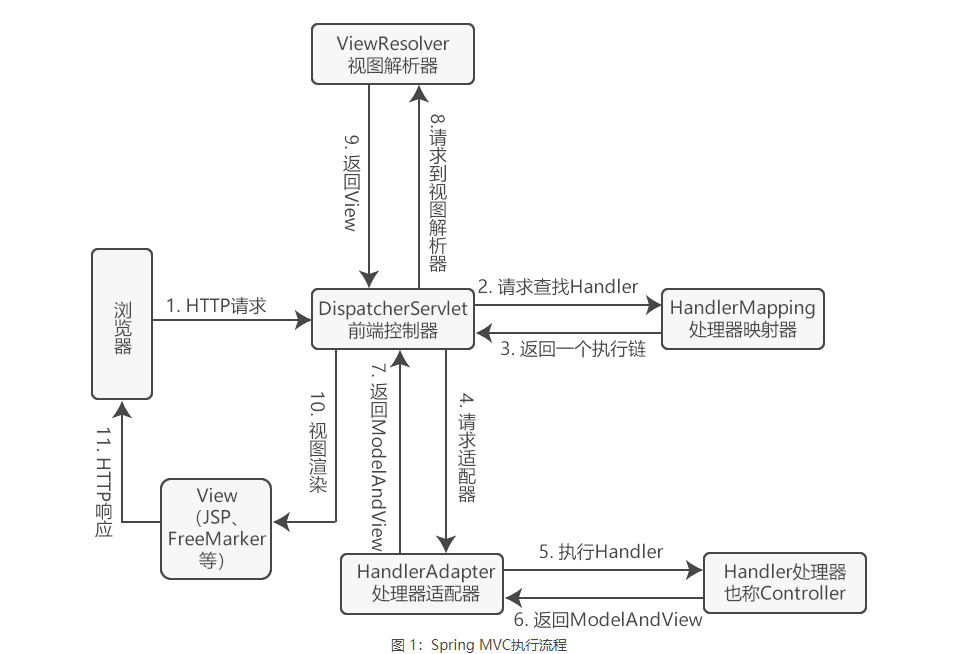

## SpringMvc几大组件

**DispatcherServlet**: 前端控制器,相当于转发器,接收请求,响应结果.减少其它组件之间的耦合度.

**HandlerMapping**: 处理器映射器,根据请求的URL,查找Handler,返回一个执行链,HandlerExecutionChain

**HandlerAdapter**: 处理器适配器,编写Handler时要按Adapter的要求去写,根据执行链去寻找Handler

**Handler**: 处理器,处理业务请求,多种实现方式,如 ***Controller*** 接口(**后台**要写的东西), 返回的是ModelAndView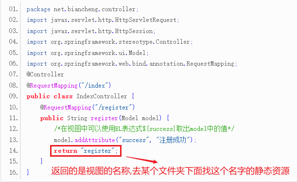

**ViewResolver**: 视图解析器,根据视图名称,生成**视图对象**

**View**: 渲染视图对象,是一个接口,支持不同的试图类型(jsp,freemarker,pdf等等) (**前台**要写的东西)


**其中DispatcherServlet是核心,对其它组件进行解耦**


## SpringMvc的优点

1.可用多种视图技术,而不局限于JSP

2.可与Spring进行整合

3.组件分工明确


## SpringMvc案例

### 1.创建一个Maven项目

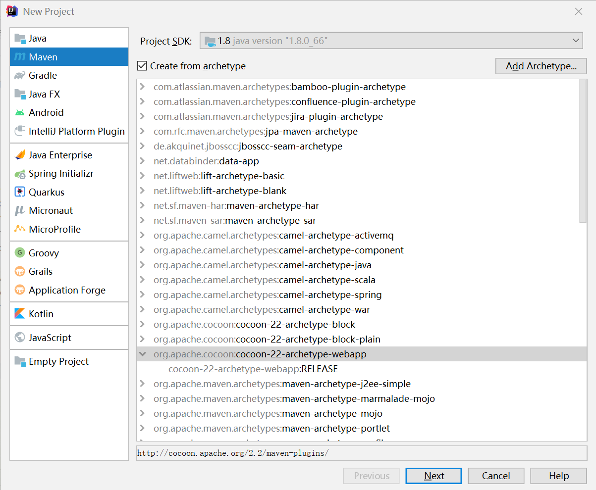

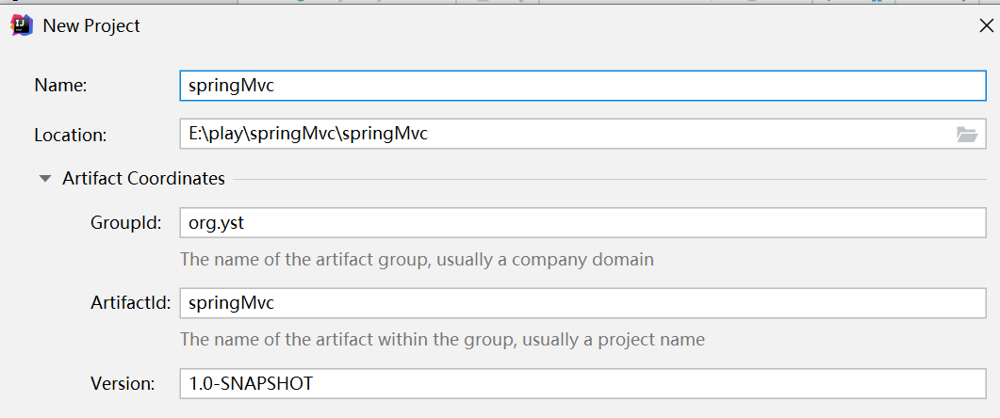

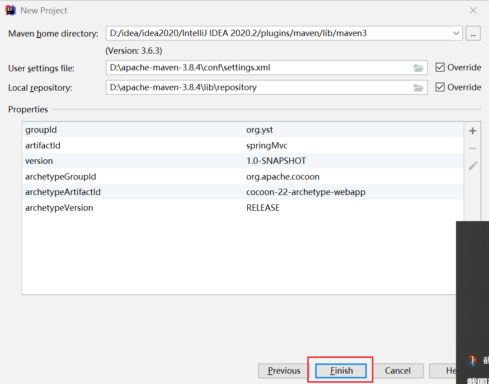

### 2.pom书写

引入两个核心依赖

```
<!-- 1.引入两个依赖-->
<dependency>
    <groupId>javax.servlet</groupId>
    <artifactId>javax.servlet-api</artifactId>
    <version>3.1.0</version>
    <scope>provided</scope>
</dependency>
<dependency>
    <groupId>org.springframework</groupId>
    <artifactId>spring-webmvc</artifactId>
    <version>5.2.10.RELEASE</version>
</dependency>
```

### 3.配置类Config书写

#### springMvcConfig

这个是原始版的SpringMvc配置文件,后被xml取代,到了Springboot里面之后,直接在web-starter里面自动配置了

```java
package com.yst.app.conf;

import lombok.extern.slf4j.Slf4j;
import org.springframework.context.annotation.ComponentScan;
import org.springframework.context.annotation.Configuration;
import org.springframework.web.servlet.config.annotation.EnableWebMvc;

/**
 * @creator: ly-yangst
 * @date: 2022/7/4
 */
@Configuration//3.创建springmvc配置文件,加载controller类型的bean
@ComponentScan("com.yst.app.controller")//3.1扫描controller
@EnableWebMvc
public class springMvcConfig {
}
```

#### springConfig

```java
package com.yst.app.conf;

import cn.hutool.core.lang.Console;
import lombok.extern.slf4j.Slf4j;
import org.springframework.context.annotation.*;
import org.springframework.stereotype.Controller;

/**
 * @creator: ly-yangst
 * @date: 2022/7/4
 */
@Configuration
@ComponentScan(//排除掉SpringMvc扫描的Bean,Spring和SpringMvc是分开注入的
        value = "com.yst.app",
        excludeFilters = @ComponentScan.Filter(
                type = FilterType.ANNOTATION,
                classes = Controller.class
        )
)
@PropertySource("classpath:jdbc.properties")//spring整合jdbc的,加载jdbc文件的
@Import({JdbcConfig.class, MybatisConfig.class}) //整合jdbc和mybatis,将两个配置类注册成bean
public class SpringConfig {
}
```

web容器启动配置

```java
package com.yst.app.conf;

import org.springframework.web.filter.CharacterEncodingFilter;
import org.springframework.web.servlet.support.AbstractAnnotationConfigDispatcherServletInitializer;

import javax.servlet.Filter;

/**
 * @creator: ly-yangst
 * @date: 2022/7/4
 */
//4.定义一个servlet容器启动的配置类,在该配置类中加载 spring的配置
public class ServletContainersInitConfig extends AbstractAnnotationConfigDispatcherServletInitializer {
	
    //加载Spring的相关配置类
    protected Class<?>[] getRootConfigClasses() {
        return new Class[]{SpringConfig.class}; //Class[0]
    }
    
	//加载SpringMvc的相关配置类
    protected Class<?>[] getServletConfigClasses() {
        return new Class[]{springMvcConfig.class};
    }

    protected String[] getServletMappings() {
        return new String[]{"/"};
    }

    //解决中文乱码
    protected Filter[] getServletFilters() {
        CharacterEncodingFilter filter = new CharacterEncodingFilter();
        filter.setEncoding("UTF-8");
        return new CharacterEncodingFilter[]{filter};
    }

//    //加载springMvc容器配置
//    protected WebApplicationContext createServletApplicationContext() {
//        AnnotationConfigWebApplicationContext ctx = new AnnotationConfigWebApplicationContext();
//        ctx.register(springMvcConfig.class);
//        return ctx;
//    }
//
//    //设置拦截路径,"/"表示全部拦截
//    protected String[] getServletMappings() {
//        return new String[]{"/"};
//    }
//
//    //加载spring相关容器配置
//    protected WebApplicationContext createRootApplicationContext() {
//        AnnotationConfigWebApplicationContext ctx = new AnnotationConfigWebApplicationContext();
//        ctx.register(SpringConfig.class);
//        return ctx;
//    }

}
```

### 4.控制器书写

```java
package com.yst.app.controller;

import com.yst.app.domain.Student;
import com.yst.app.service.UserService;
import org.springframework.beans.factory.annotation.Autowired;
import org.springframework.stereotype.Controller;
import org.springframework.web.bind.annotation.RequestBody;
import org.springframework.web.bind.annotation.RequestMapping;
import org.springframework.web.bind.annotation.RequestParam;
import org.springframework.web.bind.annotation.ResponseBody;

import java.util.List;

/**
 * @creator: ly-yangst
 * @date: 2022/7/4
 */
@Controller//2.1定义为一个bean
@RequestMapping("/user")
public class UserController {

    @Autowired
    private UserService userService;

    @RequestMapping("/selectStudentById")
    @ResponseBody //以请求体返回
    public Student selectStudentById(@RequestParam String id){
        System.out.println("selectStudentById -- > " + id);
        int i = 1/0;//模拟异常
        return userService.selectStudentById(id);

    }
}
```


5.顺便用spring整合jdbc和mybatis

#### jdbc的配置文件

jdbc.properties

```xml
jdbc.driver=com.mysql.jdbc.Driver
jdbc.url=jdbc:mysql://192.168.41.188:3306/test411?useUnicode=true&characterEncoding=UTF-8&serverTimezone=UTC
jdbc.username=root
jdbc.password=root
```

#### jdbc配置类

```java
package com.yst.app.conf;

import com.alibaba.druid.pool.DruidDataSource;
import org.springframework.beans.factory.annotation.Value;
import org.springframework.context.annotation.Bean;

import javax.sql.DataSource;


/**
 * @creator: ly-yangst
 * @date: 2022/7/5
 */
//jdbc的配置类
public class JdbcConfig {
//    =com.mysql.jdbc.Driver
//    =jdbc:mysql://192.168.41.188:3306/test411
//    =root
//    =root
    @Value("${jdbc.driver}")
    private String driver;
    @Value("${jdbc.url}")
    private String url;
    @Value("${jdbc.username}")
    private String username;
    @Value("${jdbc.password}")
    private String password;

    @Bean
    public DataSource dataSource(){
        DruidDataSource dataSource = new DruidDataSource();
        dataSource.setDriverClassName(driver);
        dataSource.setUrl(url);
        dataSource.setUsername(username);
        dataSource.setPassword(password);
        return dataSource;
    }

}
```

#### mybatis的配置类

```java
package com.yst.app.conf;

import org.mybatis.spring.SqlSessionFactoryBean;
import org.mybatis.spring.mapper.MapperScannerConfigurer;
import org.springframework.context.annotation.Bean;

import javax.sql.DataSource;

/**
 * @creator: ly-yangst
 * @date: 2022/7/5
 */
public class MybatisConfig {

    @Bean//指定domain的包
    public SqlSessionFactoryBean sqlSessionFactory(DataSource dataSource){
        SqlSessionFactoryBean factoryBean = new SqlSessionFactoryBean();
        factoryBean.setDataSource(dataSource);
        factoryBean.setTypeAliasesPackage("com.yst.app.domain");
        return factoryBean;
    }

    @Bean//指定Mapper的包
    public MapperScannerConfigurer mapperScannerConfigurer(){
        MapperScannerConfigurer msc = new MapperScannerConfigurer();
        msc.setBasePackage("com.yst.app.dao"); //@MapperScan() 扫描Mapper用的
        return msc;
    }

}
```


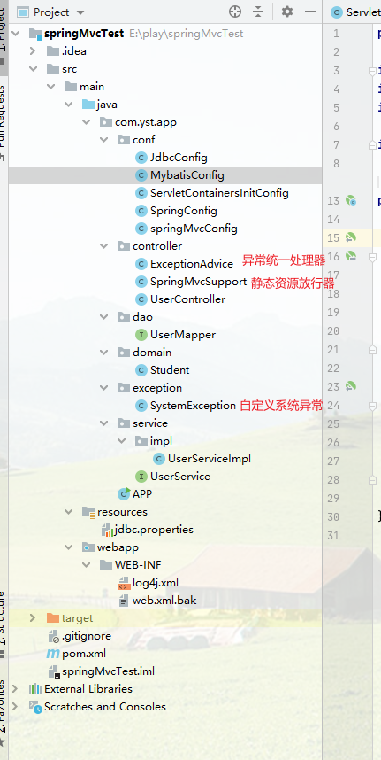

#### 完善pom

```xml
<?xml version="1.0" encoding="UTF-8"?>
<!--
  Licensed to the Apache Software Foundation (ASF) under one
  or more contributor license agreements.  See the NOTICE file
  distributed with this work for additional information
  regarding copyright ownership.  The ASF licenses this file
  to you under the Apache License, Version 2.0 (the
  "License"); you may not use this file except in compliance
  with the License.  You may obtain a copy of the License at

   http://www.apache.org/licenses/LICENSE-2.0

  Unless required by applicable law or agreed to in writing,
  software distributed under the License is distributed on an
  "AS IS" BASIS, WITHOUT WARRANTIES OR CONDITIONS OF ANY
  KIND, either express or implied.  See the License for the
  specific language governing permissions and limitations
  under the License.
-->
<!-- $Id: pom.xml 642118 2008-03-28 08:04:16Z reinhard $ -->
<project xmlns="http://maven.apache.org/POM/4.0.0" xmlns:xsi="http://www.w3.org/2001/XMLSchema-instance"
         xsi:schemaLocation="http://maven.apache.org/POM/4.0.0 http://maven.apache.org/maven-v4_0_0.xsd">

    <modelVersion>4.0.0</modelVersion>
    <packaging>war</packaging>

    <!--  <name>springMvcTest</name>-->
    <groupId>org.example</groupId>
    <artifactId>springMvcTest</artifactId>
    <version>1.0-SNAPSHOT</version>

    <build>
        <plugins>
            <plugin>
                <groupId>org.mortbay.jetty</groupId>
                <artifactId>maven-jetty-plugin</artifactId>
                <version>6.1.7</version>
                <configuration>
                    <connectors>
                        <connector implementation="org.mortbay.jetty.nio.SelectChannelConnector">
                            <port>8888</port>
                            <maxIdleTime>30000</maxIdleTime>
                        </connector>
                    </connectors>
                    <webAppSourceDirectory>${project.build.directory}/${pom.artifactId}-${pom.version}
                    </webAppSourceDirectory>
                    <contextPath>/</contextPath>
                </configuration>
            </plugin>
            <!--tomcat-->
            <plugin>
                <groupId>org.apache.tomcat.maven</groupId>
                <artifactId>tomcat7-maven-plugin</artifactId>
                <version>2.1</version>
                <configuration>
                    <port>80</port>
                    <path>/</path>
                </configuration>
            </plugin>
        </plugins>
    </build>

    <dependencies>
        <!--dependency>
          <groupId>org.example</groupId>
          <artifactId>[the artifact id of the block to be mounted]</artifactId>
          <version>1.0-SNAPSHOT</version>
        </dependency-->

        <!-- 1.引入两个依赖-->
        <dependency>
            <groupId>javax.servlet</groupId>
            <artifactId>javax.servlet-api</artifactId>
            <version>3.1.0</version>
            <scope>provided</scope>
        </dependency>
        <dependency>
            <groupId>org.springframework</groupId>
            <artifactId>spring-webmvc</artifactId>
            <version>5.2.10.RELEASE</version>
        </dependency>

        <dependency>
            <groupId>com.fasterxml.jackson.core</groupId>
            <artifactId>jackson-databind</artifactId>
            <version>2.9.0</version>
        </dependency>

        <!--德鲁伊-->
        <dependency>
            <groupId>com.alibaba</groupId>
            <artifactId>druid</artifactId>
            <version>1.2.3</version>
        </dependency>
        <!--mybatis-->
        <dependency>
            <groupId>org.mybatis</groupId>
            <artifactId>mybatis-spring</artifactId>
            <version>2.0.6</version>
        </dependency>
        <!--lombok-->
        <!--最好不用最新的版本-->
        <dependency>
            <groupId>org.projectlombok</groupId>
            <artifactId>lombok</artifactId>
            <version>1.16.20</version>
<!--            <version>RELEASE</version>-->
<!--            <scope>compile</scope>-->
        </dependency>

        <dependency>
            <groupId>org.mybatis</groupId>
            <artifactId>mybatis</artifactId>
            <version>3.5.6</version>
        </dependency>

        <dependency>
            <groupId>org.springframework</groupId>
            <artifactId>spring-jdbc</artifactId>
            <version>5.3.9</version>
        </dependency>

        <!--mysql 连接-->
        <!--没有它 Failed to obtain JDBC Connection; nested exception is java.sql.SQLException: com.mysql.jdbc.Driver] with root cause-->
        <dependency>
            <groupId>mysql</groupId>
            <artifactId>mysql-connector-java</artifactId>
            <version>8.0.11</version>
        </dependency>

        <dependency>
            <groupId>cn.hutool</groupId>
            <artifactId>hutool-all</artifactId>
            <version>5.8.2</version>
        </dependency>

    </dependencies>

</project>
```


### 5.Tomcat启动

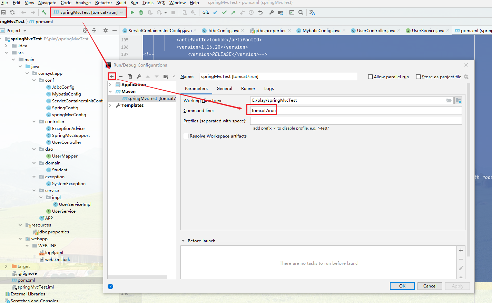

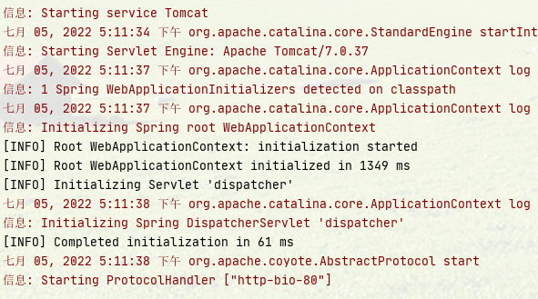

### 6.PostMan测试

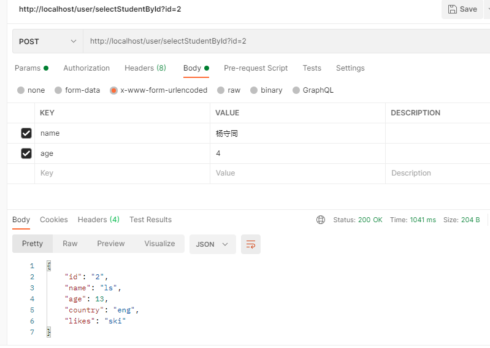