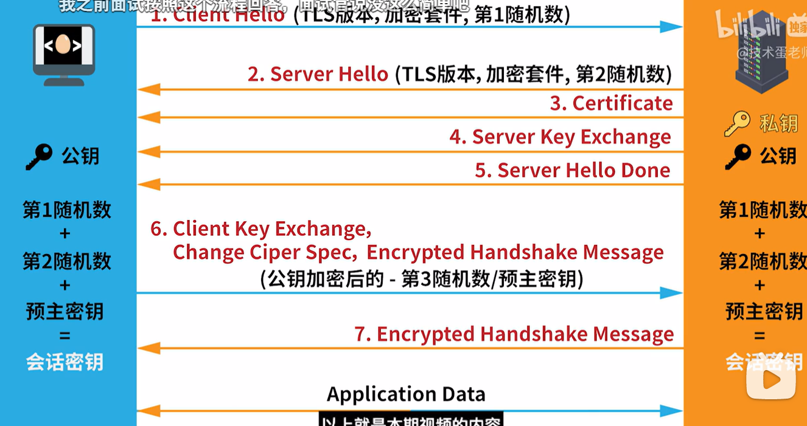

## https

https是在http的基础上,加了一层ssl安全连接层

ssl发展出了tls

tls通讯,采用的是**非对称加密**和**对称加密**的混合用法

## ssl通讯(TLS通讯)

**这里有个前提**:c和s是通过什么规则生成随机数,预主密钥的没人知道,但是最终的会话密钥怎么生成,双方都是知道的.

1.c向s打招呼,告知s自己的TLS版本,加密套件,**1号随机数**

2.s确认TLS版本,敲定加密套件,生成**2号随机数**,回发给c

3.同时s将certificate**服务器的证书**,**公钥**server Key Exchange,还有**打招呼完毕**的事实告知c

4.此时c拿着**1号随机数**,**2号随机数**,生成**3号随机数**也就是***预主密钥***

5.c将***预主密钥***通过非对称加密(公钥)后,传给s

6.s得到密文,通过自己的私钥解密,得到***预主密钥***   此时,预主密钥只有c和s知道

7.然后c和s分别通过**1号随机数**,**2号随机数**,***预主密钥***,计算出**会话密钥**

8.双方通话采用**会话密钥**,对称加密,为何不直接用公钥,私钥进行**非对称加密**(因为前面的公钥是明文传过去的,第三方可以得到你的公钥,然后伪装你和服务器对话)