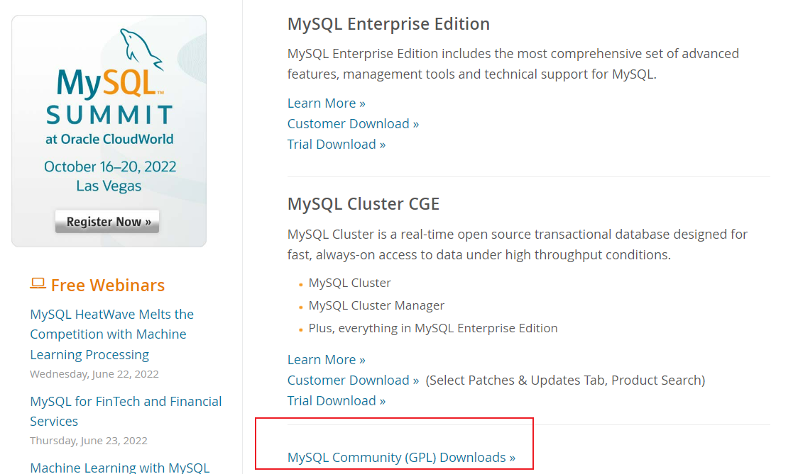
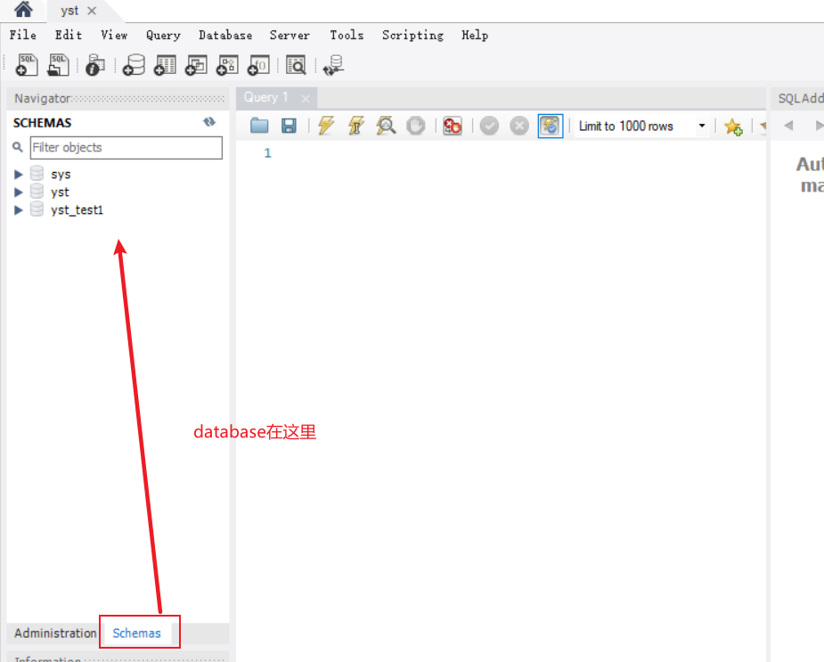

## Mysql

进入mysql官网

选择Downloads

选择社区版

选择windows版

选择版本下载

解压，然后运行这个

得到下载界面

Mysql Workbench是操作界面，可以不选，直接使用Navicat

下载完成之后

可以在下载界面查看下载位置，因为这个位置有可能下载C盘的用户下面，难以寻找

给bin目录加环境变量

可以黑窗测试

mysql -h localhost -uroot -p

说明服务已经启动

可以去看一下，设置一下自启动，以后每次开机都**自启动**

打开Mysql Workbench，测试一下

## Oracle

oracle一般不建议安装在windows上，因为耗资源

安装oracle一般3个部分，databases，client客户端，plsql操作页面

这个product文件夹里存着连接信息

可以和Idea进行对照

PLSQL有时抽风

idea能连，但plsql连不上

win + R 调出界面 cmd

采用 ctrl + shift + 回车 （以管理员身份） 连接oracle ：sqlplus system/system

用户名输入：system 密码输入 root

再连plsql，可以了