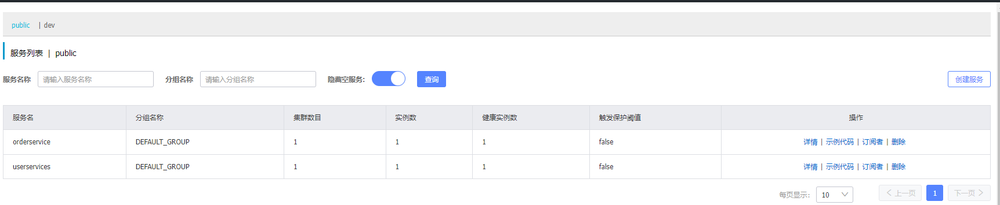

## Nacos的下载与部署

去github上拉取nacos

https://github.com/alibaba/nacos/tags


就是一个绿色版的压缩包


二选一安装即可


解压变成


进入bin启动cmd

startup.cmd -m standalone shutdown.cmd 


访问地址

http://localhost:8848/nacos/


内部页面


以上是部署在windows系统上,一般可以运行在Linux系统中


## 代码层面的配置

这里建**两个独立的微服务**


order是订单模块,其service层会用RestTemplate去向user用户模块发http请求(便于后续观察负载均衡)


引入springcloudalibaba的父工程依赖

```
<dependency>
    <groupId>com.alibaba.cloud</groupId>
    <artifactId>spring-cloud-alibaba-dependencies</artifactId>
    <version>2.2.6.RELEASE</version>
    <type>pom</type>
    <scope>import</scope>
</dependency>
```

在各个子微服务(**user-service**和**order-service**)中引入nacos-discovery依赖(服务发现)

```
<dependency>
    <groupId>com.alibaba.cloud</groupId>
    <artifactId>spring-cloud-starter-alibaba-nacos-discovery</artifactId>
</dependency>
```

然后需要在各个子工程中的application.yml,加入nacos的地址,这一步告诉本地的服务,去哪注册nacos

```
spring:
  cloud:
    nacos:
      server-addr: localhost:8848
```

这一步一写,只要服务启动,在nacos上就能看见服务,便于运维(服务一起,就可以在不动代码的情况下,进行服务的运维)



## 集群配置

并非是高大上的操作

就是我们一份服务代码,可以被复制成多份,部署在不同的服务器上,当然出于容灾考虑,大公司的服务器分布在不同的省份和地区

那么我们可以将一部分服务器上的相同服务代码,划分为一个集群.

集群为的是,提高服务的并发量,维持服务的高可用性


代码层面只要修改yml即可

```
spring:
  cloud:
    nacos:
      server-addr: localhost:8848
      discovery:
        cluster-name: HZ # 集群名称
```

order的配置


user的配置


同是一个集群的微服务,优先进行负载均衡,比如这俩都是HZ集群

 可以在idea中复制几个User的微服务,**改一下端口号**,防止冲突,**改一下集群**,看看负载均衡效果

```
-Dserver.port=8083 -Dspring.cloud.nacos.discovery.cluster-name=SH
```


这里有一个order是HZ集群,三个user,两个是HZ集群,一个是SH集群


同一集群内,还可以通过群众配置,调整负载均衡的概率


 

负载均衡测试

postman发10次请求


同集群优先处理,但多次高频点击,其它集群也可能收到,然后是权重,权重比例与负载均衡概率相当.

权重为0,则不接受任何负载均衡, 有利于版本更新时的操作


## 环境隔离

可以做到生产的服务归生产,开发的归开发,测试的归测试


将命名空间id复制到配置文件


配置之后,order绝迹江湖,因为他去了另一个空间

