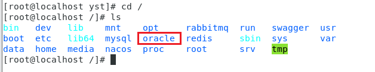
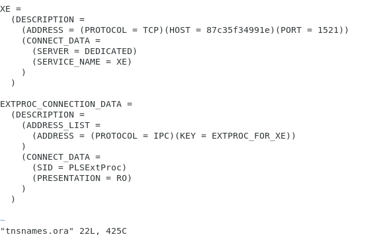
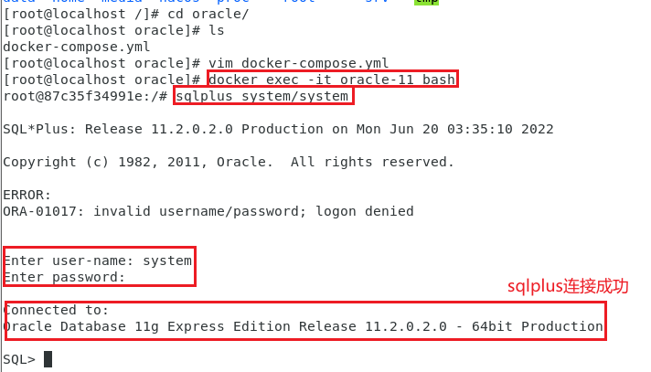
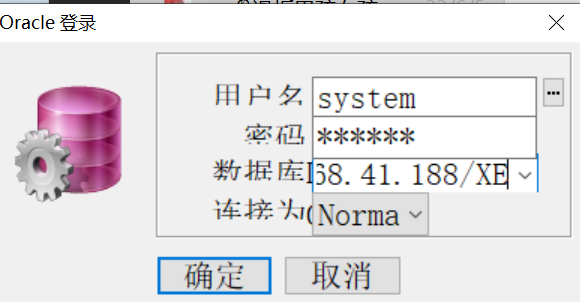
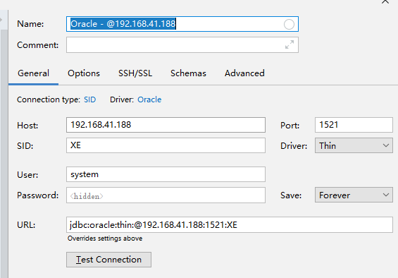

用docker-compsose部署oracle

先建一个oracle的文件夹



在oracle内部建一个docker-compose.yml文件

```
version: '3'
services:
    oracle11:
        image: oracleinanutshell/oracle-xe-11g
        container_name: oracle-11
        privileged: true
        environment:
            - TZ=Asia/Shanghai
        restart: always
        ports:
            - "1521:1521"
        volumes:
            - /data/oracle-11/data/oracle/:/u01/app/oracle/
        user: root
```

**注意：先注释掉数据卷**


启动容器(在不挂载的情况下,先启动)

```
docker-compose up -d
```

复制容器文件到宿主机

```
mkdir -p /data/oracle-11/data/ 

docker cp oracle-11:/u01/app/oracle/ /data/oracle-11/data/
```

关闭容器

```
docker-compose down
```

再修改yml,进行挂载(解除注释)

启动容器

```
docker-compose up -d
```


可以进入Network文件夹查看



 XE是数据库名

HOST不是镜像名,而是宿主机的IP

192.168.41.188

端口号1521

  

默认的

username:system

password:oracle


可以再容器目录下,进入容器

docker exec -it oracle-11 bash              (oracle-11是容器名)

进去之后,类似windows系统的cmd

输入sqlplus system/system




用plsql连



用idea连

