## 模块复制

写demo时，为了减少模块的创建，我们可以直接复制

### 1.进入模块文件夹

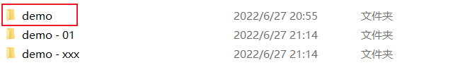

假如我们要复制demo这个模块

### 2.手动复制

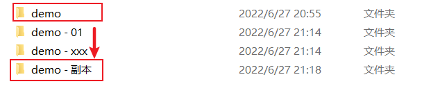

### 3.然后打开demo-副本，也就是我们复制的这个玩意

除了pom和src，其他的全部删掉

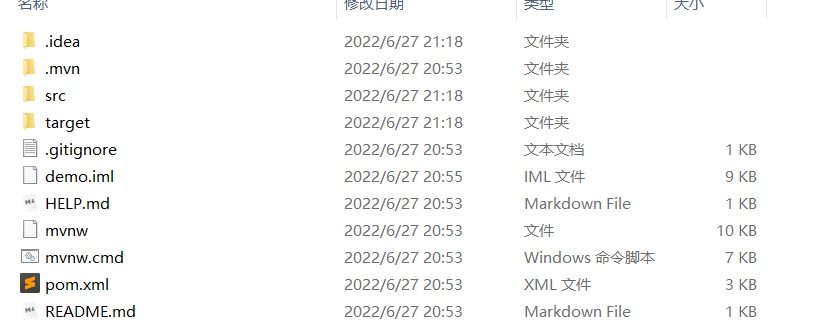

世界都清爽了

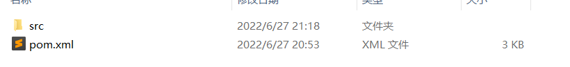

### 4.修改模块的pom

将新模块的名称写在artifactId这里，下方的name，description可以删掉，name控制的是在maven中的名字，没有name就以artifactId为准。

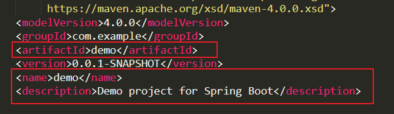

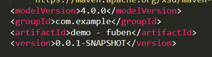

ok

### 5.去idea中导入模块

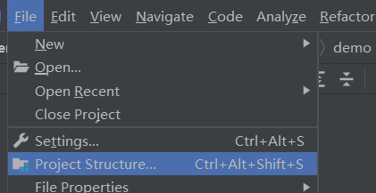

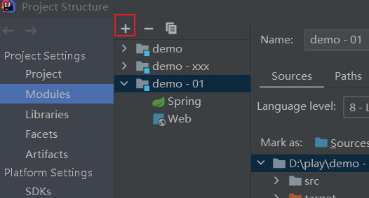

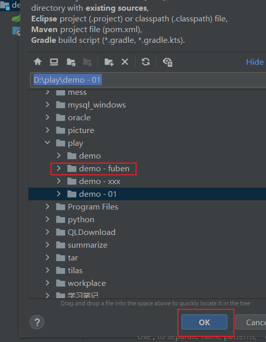

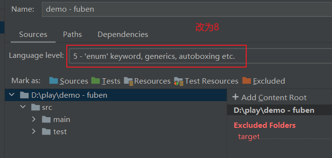

多项目启动，改一下端口号

-Dserver.port=8083

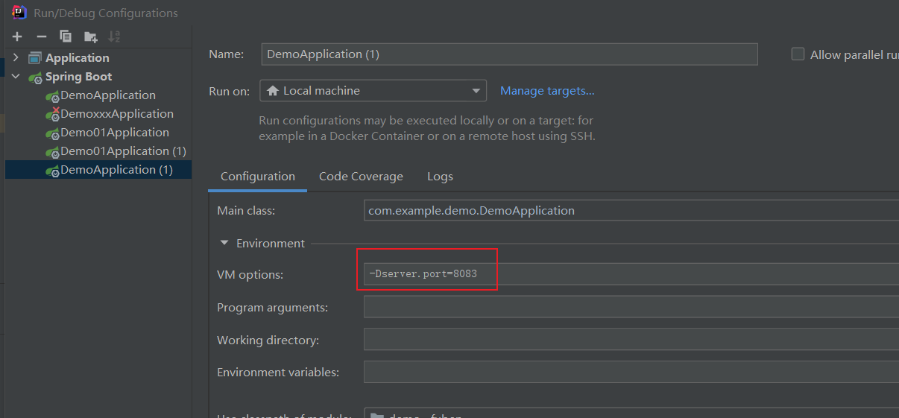

### ok了

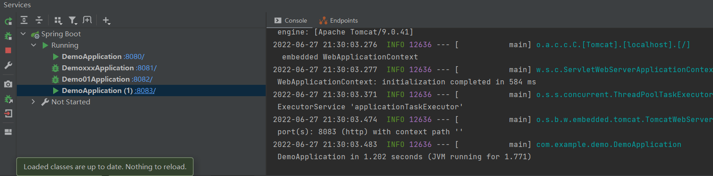