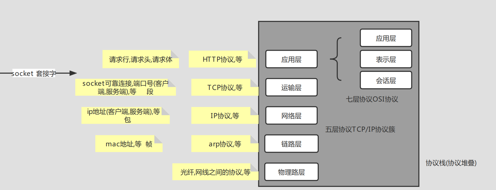
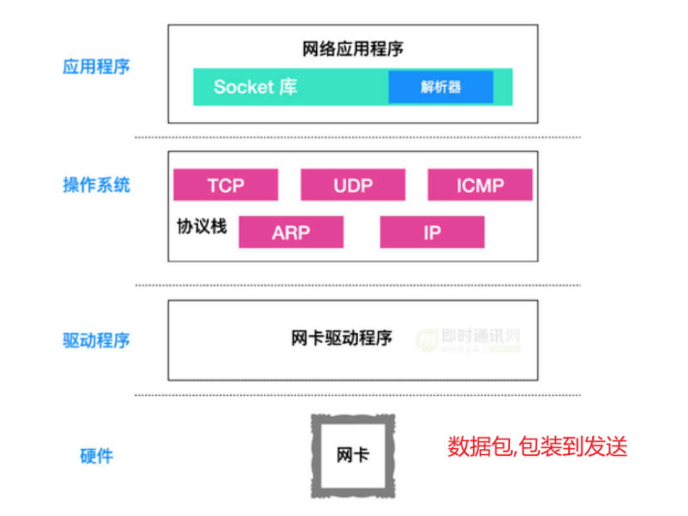
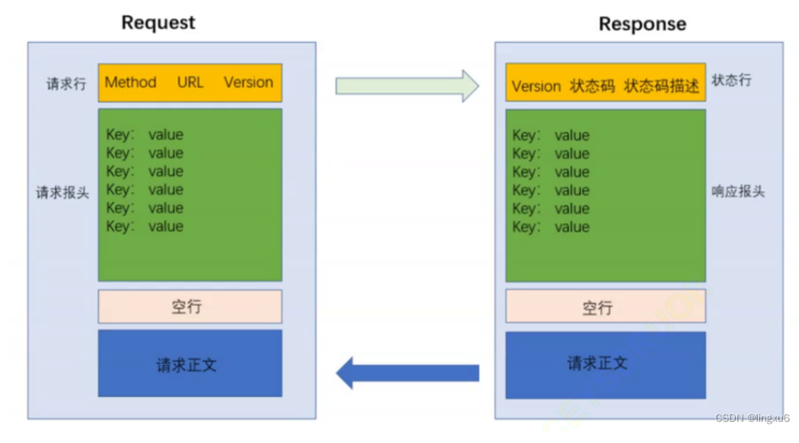
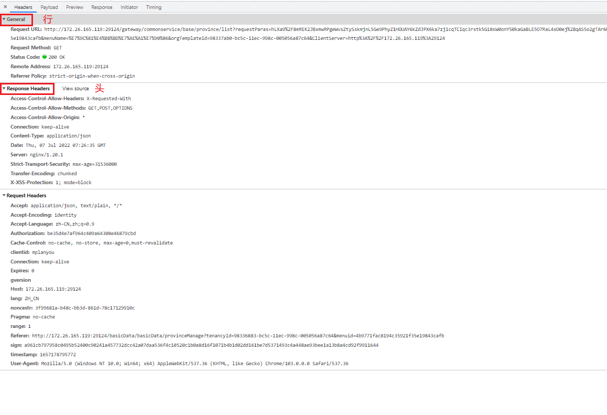
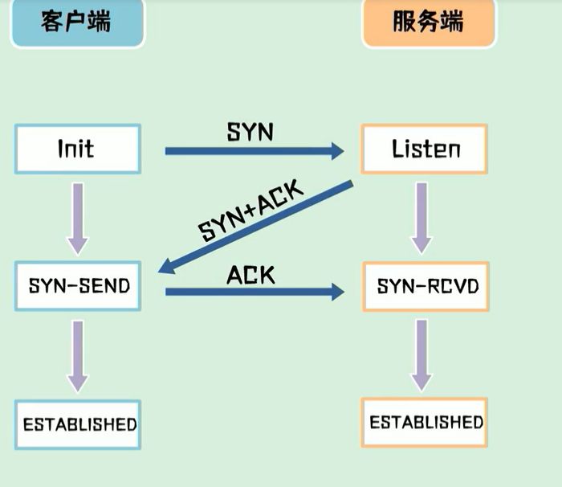
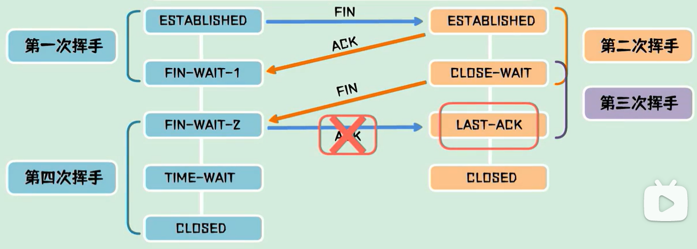
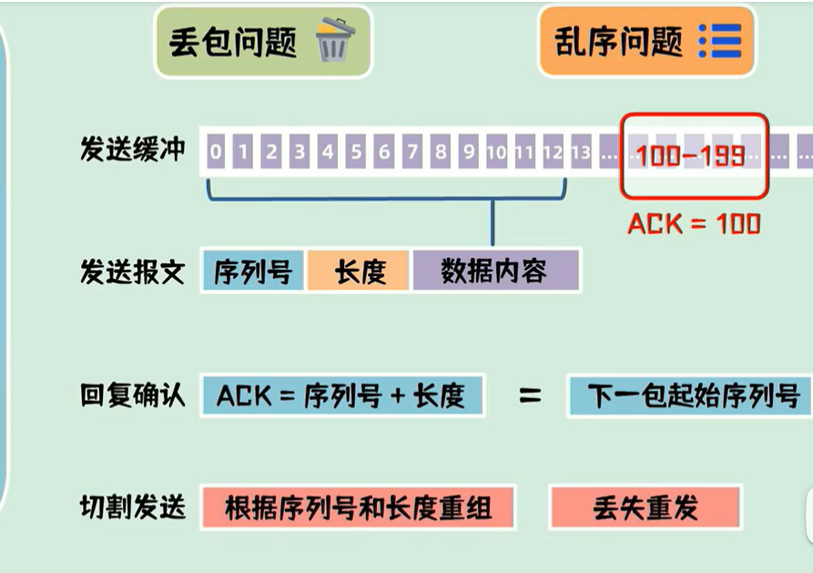

## 网络协议与分层

权威的ios颁布了**OSI七层协议**,我们常用的是**TCP/IP协议**(这个准确说是一个协议簇,只是TCP/IP协议在里面是最靓的仔)



以下是它们在计算机中**所处的位置**



可以看见,TCP,IP这两个(传输层,网络层)协议是存在与***操作系统***中的(协议栈),而应用层协议(如http)存在于***应用程序***中,所以http要给到tcp进行进一步包装,就需要一个介质,这个介质就是***Socket***(套接字,插座).


## Http协议

http超文本传输协议

http分为 行,头,空行,体

### **行**包含的信息:

http请求的方法,get,post,put,delete

请求的具体路径,url: www.blog.csdn.net

http协议的版本号,Http1.1

### **头**包含的信息

有很多键值对

### **空行**

标志着头的结束

### **体**包含的信息(这一部分可以没有)

请求的正文





### https

通常http和https没有区别,唯一的不同是,https在http基础上引入了一个**加密层**

加密层称为ssl/TLS,涉及到对称加密,和非对称加密

对称加密就是,加密解密用**同一把钥匙**,非对称加密就是,加密解密用两把钥匙(公钥,私钥),比如我们常用的JWT就是对称加密,也可以是非对称加密


## socket

***snocket***(套接字,插座)是建立在传输层协议(TCP)上的,操作网络的一套API,它也是应用层与传输层的一个插座

socket三参数,网络层协议是啥,传输层协议是啥,数据交换格式是啥(字节流?数据报文)

socket五元组,协议.本地ip,外部ip,状态,pid

socket的函数

**数据接收**函数:向系统提交接收数据的IO请求,请求内容(划给应用层的缓冲区,请求数据的尺寸,缓冲区数据的偏移量)

```c#
int rcvLen=m_socket.Receive(buf, offset, size, SocketFlags.None);
```

**数据发送**函数:向系统提交发送数据的IO请求，向指定的节点发送数据,请求内容(数据内容，长度等)

```c#
int sndLen= m_socket.Send(buf);
```

**建立连接**:信息会传递给协议栈中的 TCP 模块，TCP 模块会对请求报文进行封装，再传递给 IP 模块，进行 IP 报文头的封装，然后传递给物理层，进行帧头封装。

```
connect(<描述符>、<服务器IP地址和端口号>)
```


### 三次握手,四次挥手

三握四挥是建立在TCP协议上的,也是建立在socket上的


#### 三次握手

syn同步,ack确认  *tcp是全双工的,部分客户端服务端,二者角色可以对换*

**为什么是三次握手,而不是两次握手?**

如果是两次握手,由于网络波动,client向server发了一个syn丢了,client再重发一个syn到达了server,server发送ack两者完成两次握手都进入estabLintend状态(也就是等待发送状态)一个连接生成了.

这时,刚刚由于网络波动没发到的syn到达了server,server返回ack,然后直接生成新的连接,并进入estabLintend状态,而返回去的ack由于client的第一个连接进入的estabLintend,而且并没有建立第二个连接,所以client没有鸟它.

问题出现了,由于两次握手生成一个连接,client认为只有一个连接,而server认为有两个连接,造成资源浪费




#### 四次挥手

**为什么是四次挥手,而不是三次?**

fin就是断开;结束

client提出断开发送fin,自己进入fin-wait1阶段,此时client这边不发网络包出去了,但连接还没断开(要双方同意才可断开).

server接到fin,回发一个ack表示自己知道了,但是你等我把要发你的包发完再说

server该发的包发完了,自己进入close-wait状态,并返回fin,表示可以断开了

client接收到fin,client自己进入fin-wait-2状态

client返回ack,自己进入time-wait状态(等待2ms),为什么要等待2ms,防止ack没发到导致server不知道,等待的2ms里,丢包了server会重发fin,client重发ack

server接收到ack,正式关闭

四次挥手缺一不可,如果你是server返回ack时client直接关闭,那么server这边还没发完的包就发不出去了,不合理




### 消息确认机制

tcp是全双工的,不区分服务器与客户端,两者**角色可以对调**

**发送者**将数据分包,放入缓存区,发送报文中带着序列号,长度,数据内容

**接收者**拿到之后,返回序列号+长度

这时**发送者**根据长度确认下一包起始位置,继续发送

包到达**接收者**可能不分先后,接收者根据序号长度重组数据即可

若缺失则**接收者**发消息,让**发送者**重传



## TCP/IP协议

TCP是基于连接的可靠的传输层协议

传输层还有一个UDP,它是基于非连接的协议


IP是TCP下面的网络层的协议,里面包着ip地址


## 链路层协议ARP

IP网络层下面是链路层协议(其中一种是arp协议)

arp协议可查,每台机器的ip,也就是mac地址,这个mac地址是计算机生成时,厂商烧录在机器中的,全球唯一,与ip地址作比较,ip地址是网路颁给计算机的网络ip,有几个网卡就有几个ip地址.


## 参考资料

[网络的连接过程 - 简书 (jianshu.com)](https://www.jianshu.com/p/6fe53f593553?utm_campaign=maleskine...&utm_content=note&utm_medium=seo_notes&utm_source=recommendation)

[网络编程懒人入门(十四)：到底什么是Socket？一文即懂！ (baidu.com)](https://baijiahao.baidu.com/s?id=1724923820054134365&wfr=spider&for=pc)